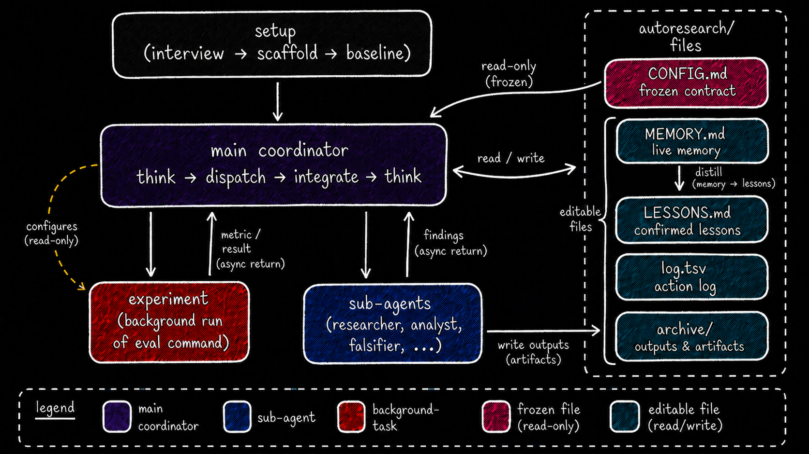
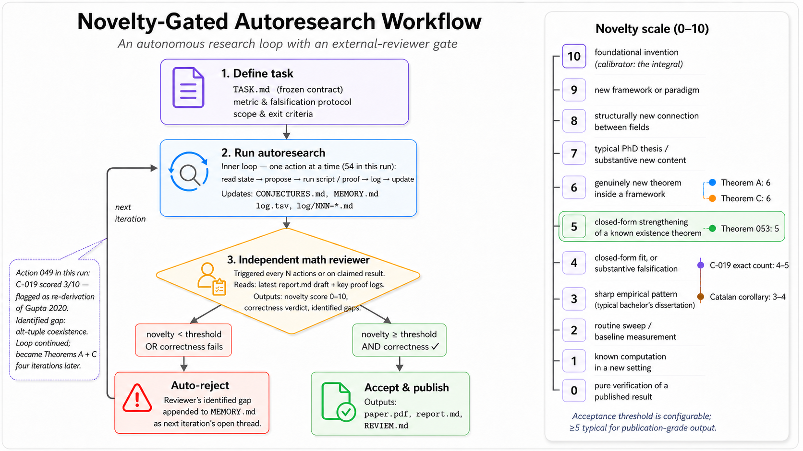
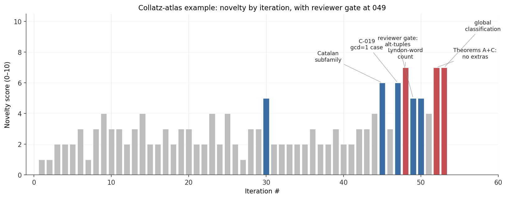

# autoresearch

**An agentic skill for autonomous optimization.**
This project was primarily inspired by Karpathy's original repository: I
iteratively found gaps in that approach and fixed them. At the same time, I
tried to keep the system as simple as possible.

Point the agent at a target file (or scope) and one scalar metric with a
direction (min/max). The main agent thread becomes an event-driven coordinator
that iterates: hypothesize → edit → eval → keep/discard → learn → repeat,
until you stop it.

Works for ML training (`val_loss`, `val_bpb`), API performance (`p50_ms`),
bundle size, prompt pass-rate, LLM-judged quality — for **any** metric that
reduces to one shell command printing one parseable scalar.

I also added a **research-only mode** for tasks without an executable
experiment: literature surveys, framework comparisons, design investigations.
The first interview question chooses the mode; the agent may skip questions
when the answers were already provided in the initial prompt. In research-only
mode the experiment steps are removed entirely, and thoughts and conclusions
are saved in the action logs.

## Install & run

I. Start Claude Code with auto mode enabled:

```bash
# Claude Code
claude --enable-auto-mode

# Codex
# Codex does not need a separate auto mode: open a normal session and install
# the skill with the command below.
```

II. Install the skill by writing:

```
install skill from AndrewK404/autoresearch-v2
```

III. Start the task:

```
run autoresearch-v2 {task description + context, if needed}
```

## Architecture

After setup, the main agent thread works as an event-driven coordinator. It
launches sub-agents in the background and integrates returns as they arrive:

- **experiment** — a background launch of the eval command.
- **researcher / analyst / falsifier / ...** — sub-agents spawned through the
  general agent mechanism: source digest, literature sweep, light EDA,
  post-mortem, attempt to disprove a hypothesis before a run.

Default concurrency: **1 experiment + 3 sub-agents in parallel** (sub-agents
run in the background).



*Architecture overview. Setup freezes `CONFIG.md`; after that, the main
coordinator reads the contract, updates the live memory/log files, dispatches
one experiment plus background sub-agents, and integrates async returns into
the next iteration.*

## File layout in the user's project

After setup, the project gets:

```
autoresearch/
├── CONFIG.md           # frozen contract: goal, metric, eval, scope,
│                       #   constraints, integrations, envs, bootstrap,
│                       #   important answers
├── MEMORY.md           # live dashboard, 400-line cap; single home for all
│                       #   user input received after setup
├── LESSONS.md          # confirmed lessons (≥ 2 keep)
├── log.tsv             # single action log
├── log/                # detailed NNN-<type>-<info>.md
│                       #   (for example, 023-experiment-batch-256.md)
├── memory/             # archived MEMORY.md snapshots (NNN-memory.md)
└── archive/            # PDFs, scripts, notebooks, intermediate data
                        #   (the only path for sub-agents)
```

## Core rules

1. **Single target, single scalar.** Drift is impossible; keep/discard is just
   `<` or `>`.
2. **Frozen contract.** `CONFIG.md` and the eval command are immutable after
   baseline. After setup, every new piece of user input goes into
   `MEMORY.md`, never `CONFIG.md`.
3. **Experiments are ground truth; research is advisory.** Only ≥ 2 keep
   experiments promote a claim into `LESSONS.md`.
4. **Disproof checks over confirmation.** Every hypothesis gets an explicit
   condition under which it should be considered wrong.
5. **Async and event-driven.** Main is idle only when capacity is full and the
   Queue is empty.
6. **Strategy escalation by experiment count.** 1–5 / 6–15 / 16–30 / 30+ — the
   strategy level is explicit and escalates one level early on plateau.
7. **Expensive resources never sit idle.** While an experiment runs, main works
   in parallel: research, pruning, sharpening.
8. **Never gives up.** Plateau is a signal to escalate, not to stop.
9. **Artifacts are not lost.** All additional files are saved in `archive/`, so
   agents can quickly find already collected information later.

## Examples

See `examples/` for worked autoresearch-v2 runs. Each task lives in its own
subdirectory (`examples/<task-name>/`) containing the working tree
(`autoresearch/`), source artifacts, figures, and `report.md`. There is one
example for now; the list will grow, including with external examples.

### Example: Collatz-atlas

`examples/collatz-atlas/` — a research-only run on generalized Collatz
dynamics. Headline result: a Lyndon-word bijection for primitive cycles on the
m=1 hypersurface and an infinite 2D family of "tractable cousins" of Collatz
with explicit cycle counts.

As much as I tried to make autoresearch universal, agents still work best
together with a human, especially on research tasks. In this case I added a
novelty scoring scale and automatic review by a sub-agent so the loop would
not stop before reaching the required quality.

**Practical takeaway:** in research tasks, it is useful to define an explicit
novelty criterion and an external reviewer gate. Without that gate, the agent
can stop at a plausible result that is not actually new enough.



*Reference example workflow. The Collatz-atlas run shows how a research-only
task is scoped, iterated through the autoresearch loop, checked by an
independent reviewer gate, rejected when novelty/correctness falls short, and
accepted only after the reviewer-identified gap is closed.*

I also noticed that an autoresearch agent usually needs a few dozen experiments
or research iterations — often several hours — to accumulate enough context.
New results usually do not appear immediately; they appear after the agent has
built a local map of the task.



*Novelty score by iteration for Collatz-atlas. Novelty: higher is better. Gray
bars show preparatory and verification steps; blue and red bars mark
iterations where the agent reached more substantive results. The reviewer gate
at iteration 049 prevented the run from stopping on an inflated claim.*

## TODO

- Add interaction with Agent Teams instead of a single main agent.
- Move beyond linear keep/discard against the current best: add branching /
  tournament search, possibly in the spirit of Tree-of-Thought approaches.
- Add a strong LLM judge so the system can evolve normally on abstract tasks.
  The reviewer in the example is a partial implementation of this.
- Cross-project lessons transfer: move `LESSONS.md` between autoresearch
  projects so the agent does not relearn the same mistakes from scratch.

## Inspiration

- [Andrej Karpathy's autoresearch](https://github.com/karpathy/autoresearch) —
  the original minimal single-file / single-metric autonomous loop.
- [Anthropic's multi-agent research system](https://www.anthropic.com/engineering/multi-agent-research-system) —
  sub-agent architecture and task briefing.
- [Popper](https://arxiv.org/abs/2502.09858), [AIGS](https://agent-force.github.io/AIGS/) —
  hypothesis validation through disproof-first checks.
- [Sakana AI Scientist-v2](https://github.com/SakanaAI/AI-Scientist-v2) —
  progressive experimentation.
- MemGPT / [Letta](https://www.letta.com/blog/agent-memory),
  [Generative Agents](https://arxiv.org/abs/2304.03442) — long-term memory
  patterns.
