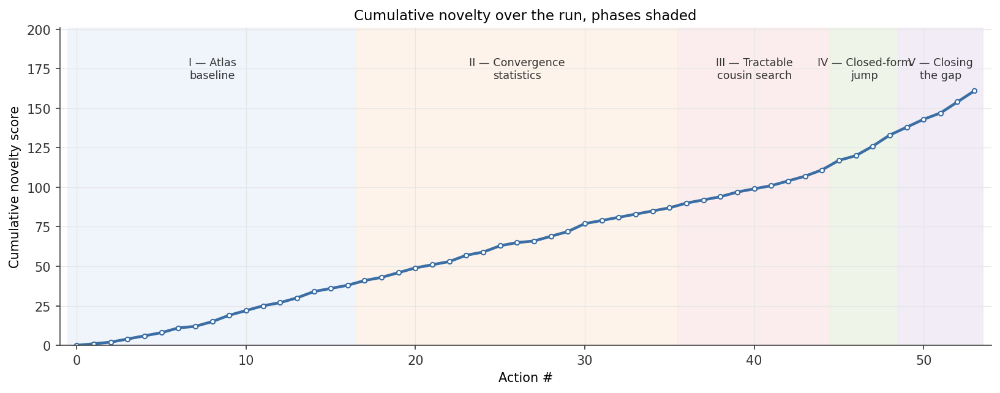

# Report — generalized Collatz dynamics, autoresearch run

> Mathematical paper: [`paper.pdf`](paper.pdf) (LaTeX source: [`paper.tex`](paper.tex)).
> Independent math review and supporting files: [`other/`](other/).

---

## 1. The result, in plain English

### 1.1 What the theorem is about

The Collatz conjecture asks whether iterating "halve if even, otherwise
3n + 1" always reaches 1. We don't know. A reasonable adjacent question:
in the *family* of similar maps `T_{a,b}(n) = n/2` (n even), `a·n + b`
(n odd), with a, b odd integers — which (a, b) admit cycles, and how
many cycles of each length? That's the **parameter atlas** problem.

There's a special "thin slice" of parameter space — cells of the form
`(a, b = 2^K − a^L)` — called the **m = 1 hypersurface**. On this
slice every cell admits cycles of length `K + L`. Gupta (2020) proved
they exist; nobody had given an exact count.

### 1.2 What the agent proved

> The cell `(a, b = 2^K − a^L)` admits **exactly** `L_{K,L}` primitive
> cycles of length `K + L`, where `L_{K,L}` is the count of binary
> Lyndon words of length K with L ones.

A binary Lyndon word is the lexicographically smallest rotation of a
binary string — a classical object in combinatorics (OEIS A001037).
The bijection: each Lyndon word becomes the odd-step pattern of one
primitive cycle. Two infinite tractable subfamilies fall out as
corollaries — `K = 2L ± 1` at `a = 3` give the **Catalan numbers**
`C_{L−1}` (for L ≥ 3) and `C_L` (for L ≥ 1).

The path from existence (Gupta) to *exact* count required four new
theorems (A, B, C, 053). Full statements, proofs, and references in
[`paper.pdf`](paper.pdf) ([source](paper.tex)).

---

## 2. The agent's work, scored by novelty

*Figure 0. Workflow for this example. The loop runs one iteration at a
time, records state in `CONJECTURES.md`, `MEMORY.md`, and `log/NNN-*.md`,
then routes claimed results through an independent reviewer gate. The gate
kept the run open at iteration 049 after finding an alt-tuple gap; iterations
052–053 closed that gap before publication.*

### 2.1 The novelty scale

To track progress and gate the loop's exit condition, each logged
iteration was scored on a 0–10 **novelty** scale relative to prior
literature in the sub-area:

| Score | Meaning | Comparable artifact |
|---|---|---|
| 0 | pure verification of a published result | textbook exercise |
| 1 | reproducing a known computation in a new setting | undergraduate lab report |
| 2 | routine sweep, baseline measurement | undergraduate term paper |
| 3 | a sharp empirical pattern (r > 0.95 across cases) | typical bachelor's dissertation |
| 4 | closed-form fit, or a substantive falsification | strong bachelor's / weak master's thesis |
| 5 | closed form strengthening a known existence theorem | master's thesis; INTEGERS-tier short note |
| 6 | genuinely new theorem inside an existing framework | strong master's / weak PhD chapter |
| 7 | substantive new mathematical content (new identity, new argument) | typical PhD thesis |
| 8 | structurally new connection between fields | strong PhD; *Annals* / *JAMS* paper |
| 9 | new framework or paradigm | landmark monograph; Wiles on FLT, Perelman on Poincaré |
| 10 | foundational invention | Newton–Leibniz integral, Galois theory, set theory |

The reviewer's calibration of this run landed at **5**; the agent's
self-assessment was 5–6. Per-component (reviewer): Theorem A 6,
Theorem C 6, Theorem 053 5, Catalan corollary 3–4, C-019 exact
count 4–5.

The scale also gated the loop. Up to iteration 048 the headline was
"C-019: closed form, novelty 7." A math-reviewer sub-agent scored it
3/10 — *re-derivation of Gupta 2020 + standard Möbius counting*. The
reviewer's feedback identified the real open gap (alt-tuple coexistence
at the same total length T), which became the next iteration's input.
Iterations 052–053 closed that gap with new content; the reviewer's second
pass scored those 5–6/10 with no exact prior-art duplicate. Without the
gate the run would have stopped at 048 with an inflated claim.

### 2.2 Novelty by iteration

*Figure 1. Novelty score for each Collatz-atlas iteration. The x-axis uses the
same numeric IDs as `autoresearch/log.tsv`; the highlighted labels mark the
closed-form jump, the reviewer gate, and the final proof recovery.*

Fifty-four iterations, two days. Long flat plateau at 1–4 (atlas building,
convergence statistics) until iteration **045** (first Catalan family) and
**048** (Lyndon-word full form) — the closed-form jump. Iteration **049**
is the *reviewer pivot*. Iterations **052–053** close the gap with
genuinely new content (Theorems A, C, and the global classification).

### 2.3 Cumulative progress

*Figure 2. Cumulative novelty across the same logged IDs, with the run's
working phases shaded.*

The slope changes are visible: phases I–III (atlas + statistics +
tractable cousin search) are shallow and linear; phase IV (closed
forms) jumps; phase V dips at 049 then steepens through 052–053.

---

## Artifacts

- **Mathematical paper:** [`paper.pdf`](paper.pdf) ([source](paper.tex)) — full theorems,
  proofs, empirical verification, references.
- **Per-action logs and conjecture ledger:** `autoresearch/log/`,
  `autoresearch/CONJECTURES.md`, `autoresearch/log.tsv`.
- **Verification scripts and parquets:** `autoresearch/archive/`.
- **Figures:** `../assets/` (matplotlib source `figures/make_figures.py`).
- **Independent math review, original task statement, atlas script,
  project README:** [`other/`](other/).
